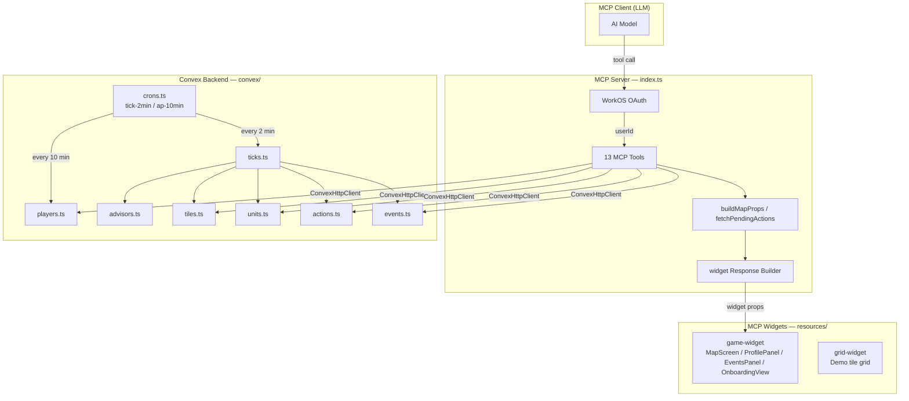
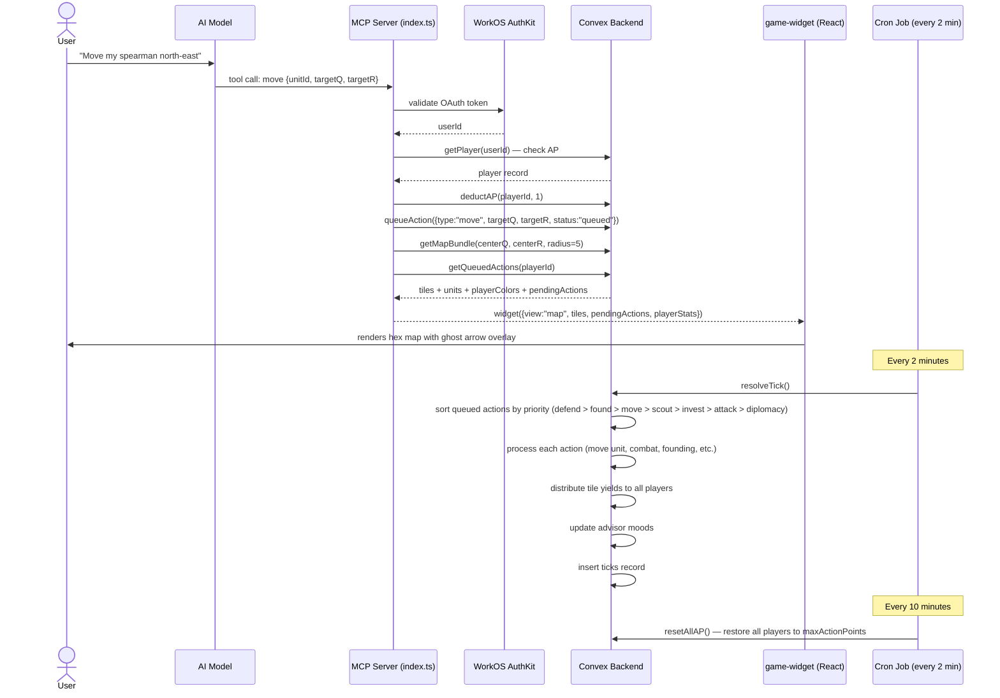
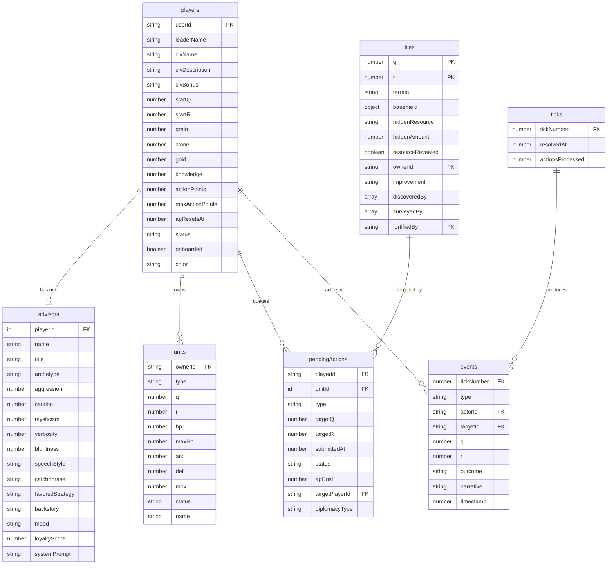
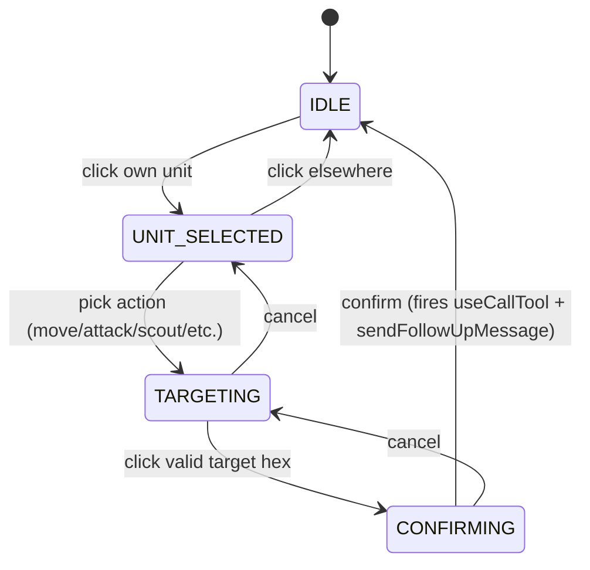

# Ancient Empires

A Civilization-style hex strategy game built as an MCP server. Players manage ancient civilizations — inspired by Assyrian and Babylonian aesthetics — on a procedurally generated hexagonal world. The AI model acts as the strategic mind, issuing orders through 13 MCP tools, while a React widget renders the battlefield in real time.

---

## Table of Contents

- [Overview](#overview)
- [Architecture](#architecture)
- [System Component Diagram](#system-component-diagram)
- [Data Flow: Action to Resolution](#data-flow-action-to-resolution)
- [Database Schema](#database-schema)
- [Game Widget Component Hierarchy](#game-widget-component-hierarchy)
- [WorkOS Integration](#workos-integration)
- [MCP Widgets](#mcp-widgets)
- [MCP Tools Reference](#mcp-tools-reference)
- [Game Mechanics](#game-mechanics)
- [Setup and Installation](#setup-and-installation)
- [Environment Variables](#environment-variables)

---

## Overview

Ancient Empires is an MCP server (`index.ts`) that connects an AI model to a persistent multiplayer strategy game. On each conversation turn, the model calls tools to issue orders — move units, found cities, launch attacks, open diplomatic channels. Every two minutes, a Convex cron job resolves all queued actions in priority order, distributes territory yields, and updates advisor moods. A React MCP widget renders the hex map, resource HUD, and event log directly inside the chat interface.

Key characteristics:

- **Tick-based asynchronous resolution** — actions queue optimistically, resolve every 2 minutes
- **Axial hex coordinate system** `(q, r)` with pointy-top orientation
- **Seeded deterministic procedural terrain** using FNV-1a hash
- **Per-player fog of war** via `discoveredBy[]` arrays on tile documents
- **WorkOS AuthKit OAuth** gates every tool call; `userId` scopes all player data
- **Multi-player** — each authenticated user has an independent civilization

---

## Architecture

Three layers compose the system:

```
┌────────────────────────────────────────────────┐
│                  MCP Clients                   │
│         (Claude, any MCP-compatible LLM)       │
└──────────────────────┬─────────────────────────┘
                       │ MCP Protocol (tools + resources)
┌──────────────────────▼─────────────────────────┐
│              MCP Server (index.ts)             │
│  mcp-use/server  •  13 tools  •  WorkOS OAuth  │
└──────┬──────────────────────────┬──────────────┘
       │ ConvexHttpClient          │ widget() return
┌──────▼──────────────┐   ┌───────▼──────────────┐
│   Convex Backend    │   │     MCP Widgets       │
│  convex/ directory  │   │   resources/ dir      │
│  7 tables, queries, │   │  game-widget (React)  │
│  mutations, crons   │   │  grid-widget (demo)   │
└─────────────────────┘   └──────────────────────┘
```

---

## System Component Diagram



---

## Data Flow: Action to Resolution



---

## Database Schema

Seven Convex tables with typed indexes:



---

## Game Widget Component Hierarchy

```mermaid
graph TD
    GameWidget["GameWidget (widget.tsx)\nuseWidget hook — receives Props from server"]

    GameWidget --> McpUseProvider["McpUseProvider (autoSize)"]
    McpUseProvider --> SkeletonMapScreen["SkeletonMapScreen\nshown while loading"]
    McpUseProvider --> GameChrome["GameChrome\nDecorative shell — Cinzel font, dark theme"]
    McpUseProvider --> MapScreen["MapScreen\nPrimary view — rendered once map data exists"]

    GameChrome --> OnboardingView["OnboardingView\nInstructs user to call onboard tool\nshows advisor archetype options"]

    MapScreen --> TopBar["Top HUD Bar\nresources (grain/stone/gold/knowledge)\nAP counter + reset countdown\ntick countdown + events toggle"]
    MapScreen --> ModeBanner["Mode Banner\nTARGETING / CONFIRMING phase indicator\nCancel button"]
    MapScreen --> SVGMap["SVG Hex Map\n560x420 viewport, zoom 0.5x–2.5x\nterrain tiles, territory overlay\nunit tokens, fog of war glyph"]
    MapScreen --> GhostOverlays["GhostOverlays\nAnimated SVG arrows for pending actions\nmove=dashed arrow, attack=red line\ndefend=teal circle, scout=blue rings"]
    MapScreen --> HexDetailPanel["Hex Detail Panel\nterrain / improvement / owner info on click\nunit stats when own unit selected"]
    MapScreen --> ActionBar["Action Bar (UNIT_SELECTED phase)\nmove(1AP) attack(2AP) defend(1AP)\nscout(1AP) found(3AP) invest(2AP)"]
    MapScreen --> ConfirmBar["Confirm Bar (CONFIRMING phase)\nConfirm / Cancel + optimistic AP deduction"]
    MapScreen --> ProfileBar["Bottom Profile Bar (IDLE phase)\nleader + civ name + advisor catchphrase\nclick to open ProfilePanel"]
    MapScreen --> EventsPanel["EventsPanel (slide-in overlay)\nscrollable event cards\nexpandable narrative text"]
    MapScreen --> ProfilePanel["ProfilePanel (slide-up overlay)\nresource grid, AP bar + countdown\nterritory count, queued action count\nadvisor card with mood indicator\nunit roster with HP bars"]
```



Interaction state machine inside `MapScreen` (`resources/game-widget/components/MapScreen.tsx`):



---

## WorkOS Integration

WorkOS AuthKit provides OAuth authentication for every tool invocation in the MCP server.

**Where it is configured** — `index.ts:86`:

```typescript
const server = new MCPServer({
  name: "civ-hex-game",
  // ...
  oauth: oauthWorkOSProvider(),
});
```

**How it flows at runtime:**

1. The MCP client initiates an OAuth flow through WorkOS AuthKit using the `MCP_USE_OAUTH_WORKOS_SUBDOMAIN` subdomain.
2. On successful authentication, the mcp-use framework injects the authenticated user into every tool handler as `ctx.auth.user.userId`.
3. Every tool handler extracts `userId` and uses it to scope all Convex queries — players, units, actions, and events are all filtered by this identifier via `by_userId` indexes.
4. No tool can read or mutate another player's private data.

**Pattern used consistently across all 13 tools:**

```typescript
async (args, ctx) => {
  const userId = ctx.auth.user.userId;
  const player = await convex.query(api.players.getPlayer, { userId });
  // ...
}
```

**Required environment variable:**

```
MCP_USE_OAUTH_WORKOS_SUBDOMAIN=<your-workos-subdomain>
```

---

## MCP Widgets

### game-widget (`resources/game-widget/`)

The primary interactive UI for Ancient Empires. A React application bundled by `mcp-use build` and served as an MCP resource. The widget receives typed `Props` (defined in `resources/game-widget/types.ts`) from the server on each tool response and maintains local state for optimistic UI updates.

**Four views driven by the `view` prop:**

| View | Triggered by | Description |
|------|--------------|-------------|
| `onboarding` | `get-status` (unonboarded player) | Instructions to call `onboard` with civilization details |
| `map` | `get-status`, `get-map`, any action tool | Full hex map with SVG rendering, unit tokens, pending ghost overlays, resource HUD |
| `profile` | `get-profile` | Slide-up panel: resources, AP bar, unit roster with HP bars, advisor card |
| `events` | `get-events`, `diplomacy` | Slide-in panel: scrollable tick event cards with expandable narratives |

**Optimistic updates:** When the player clicks an action button, the widget immediately deducts AP from the local counter and renders a ghost overlay for the pending action before the Convex tool call resolves.

**Direct tool invocation from the widget:** `MapScreen.tsx` uses `useCallTool` hooks from `mcp-use/react` to call `move`, `attack`, `defend`, `scout`, `found`, and `invest` directly from hex click interactions, bypassing a second LLM round-trip. After each action, `sendFollowUpMessage` notifies the advisor in-conversation.

**Hex rendering math** (`resources/game-widget/hex-utils.ts`):
```
x = HEX_SIZE * (√3 × q + (√3/2) × r)
y = HEX_SIZE * (1.5 × r)
HEX_SIZE = 28px
```

### grid-widget (`resources/grid-widget/`)

A simpler 2D tile grid widget that serves as a demonstration scaffold. It does not connect to the game backend and is not used in active gameplay. Useful as a reference pattern for building additional MCP widgets. Supports dark/light theme via the `theme` prop.

---

## MCP Tools Reference

| Tool | AP Cost | Category | Description |
|------|---------|----------|-------------|
| `get-status` | — | Lifecycle | Always call first. Returns onboarding view or current map. |
| `onboard` | — | Lifecycle | Create civilization, advisor, and starting units (2 spearmen + 1 scout). |
| `restart` | — | Lifecycle | Wipe all player data and return to onboarding. |
| `get-map` | — | Information | Render hex map centered on optional `(centerQ, centerR)`. |
| `get-profile` | — | Information | Show resources, AP, advisor, unit roster, territory count. |
| `get-events` | — | Information | Show recent world events with tick number and narrative. |
| `move` | 1 | Action | Queue unit movement to target hex. Resolves at next tick. |
| `attack` | 2 | Action | Queue attack on adjacent hex. Combat resolved at next tick. |
| `defend` | 1 | Action | Fortify unit at current position; claims tile if unowned. |
| `scout` | 1 | Action | Reveal fog of war in radius 2; survey resources on owned tiles. |
| `found` | 3 | Action | Claim unclaimed tile as settlement; reveals hidden resource. |
| `invest` | 2 | Action | Build farm (plains/river/forest) or mine (mountain/desert) on owned tile. |
| `diplomacy` | 1 | Action | Send diplomatic gesture to another player: `alliance`, `trade`, `warning`, `tribute`, `denounce`. |

**Action resolution priority order** (within a tick, defined in `convex/ticks.ts`):

```
defend → found → move → scout → invest → attack → diplomacy
```

---

## Game Mechanics

### Resources

Four resources accumulate per tick from owned tiles:

| Resource | Primary Sources | Improvement Bonus |
|----------|----------------|-------------------|
| Grain | Plains (2), Forest (1), River (1) | +2 from farm on plains/river/forest |
| Stone | Mountain (3), Desert (1), Forest (1) | +2 from mine on mountain/desert |
| Gold | River (2), Desert (1), Sea (1) | — |
| Knowledge | Sea (1) | — |

Hidden resources (revealed on `found` or `scout` on owned tiles) provide an additional per-tick bonus.

### Units

| Unit | Role |
|------|------|
| Spearman | Core infantry; starting unit |
| Archer | Ranged combat |
| Cavalry | High mobility |
| Siege | Breaches fortifications |
| Builder | Required for `invest` actions |
| Scout | Required for `scout` actions; high vision radius |

### Combat Resolution

```
damageToDefender = max(1, attackerATK − (defenderDEF + fortifyBonus + fortressBonus))
damageToAttacker = max(0, defenderDEF − attackerATK)

fortifyBonus  = +2 if unit status is "fortified"
fortressBonus = +2 if tile improvement is "fortress"
```

### Fog of War

Each tile carries a `discoveredBy: string[]` array. A tile is visible only if the player's `userId` is in that array. Units and improvements on hidden tiles are not transmitted to the widget. Movement reveals radius 1; `scout` reveals radius 2.

### Timing

| Schedule | Event |
|----------|-------|
| Every 2 minutes | Tick resolution — all queued actions processed, resources distributed |
| Every 10 minutes | AP reset — all active players restored to `maxActionPoints` (10) |

---

## Setup and Installation

### Prerequisites

- [Bun](https://bun.sh) — runtime and package manager (see `CLAUDE.md`)
- [Convex](https://convex.dev) account for backend hosting
- [WorkOS](https://workos.com) account with AuthKit configured
- [mcp-use](https://mcp-use.com) account for MCP server hosting

### Install Dependencies

```bash
bun install
```

### Configure Convex

```bash
bunx convex dev
```

Starts the Convex dev server and applies the schema from `convex/schema.ts`. The deployment URL is printed to the console — copy it as `CONVEX_URL`.

### Configure Environment

```bash
cp .env.example .env
```

Fill in the values described in [Environment Variables](#environment-variables).

### Run Locally

```bash
bun run dev
```

Starts the MCP server on `http://localhost:3000`. Open `http://localhost:3000/inspector` to test tools.

### Build

```bash
bun run build
```

### Deploy

```bash
bun run deploy
```

Deploys to mcp-use hosting using values from `.env`.

---

## Environment Variables

| Variable | Required | Description |
|----------|----------|-------------|
| `CONVEX_URL` | Yes | Convex deployment URL (e.g. `https://your-project.convex.cloud`) |
| `MCP_URL` | Yes | Public URL of the MCP server (used for widget base URLs) |
| `MCP_USE_OAUTH_WORKOS_SUBDOMAIN` | Yes | WorkOS AuthKit subdomain for OAuth flow |
| `MCP_USE_API_KEY` | Yes | mcp-use platform API key for deployment |

`CONVEX_URL` is consumed in `index.ts`:
```typescript
const convex = new ConvexHttpClient(process.env.CONVEX_URL!);
```

`MCP_URL` sets the server's `baseUrl` for resource resolution:
```typescript
const server = new MCPServer({
  baseUrl: process.env.MCP_URL || "http://localhost:3000",
  // ...
});
```
